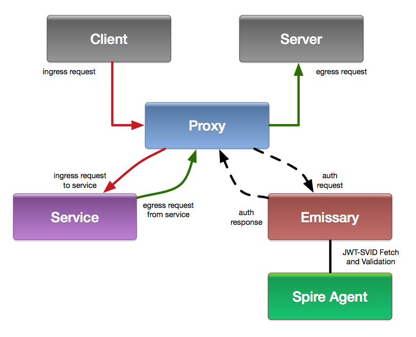

# Emissary

This is a service that communicates with [spire-agent](https://github.com/spiffe/spire/blob/master/doc/spire_agent.md) to fetch and validate [JWT-SVIDs](https://github.com/spiffe/spiffe/blob/master/standards/JWT-SVID.md) sent to it over HTTP, usually from [envoy](https://www.envoyproxy.io/) using [ext_authz](https://www.envoyproxy.io/docs/envoy/latest/configuration/http/http_filters/ext_authz_filter#config-http-filters-ext-authz).

__Note__: :construction: Emissary is fully functional and well tested but should be considered alpha/experimental software. If you find any bugs please let us know by opening an issue or pull request.

## How Emissary Works

Emissary uses Envoy's `ext_authz` filter (or another means in any proxy to perform sub-requests and act on the results, lua, etc) to allow or deny requests into and out of a service. Emissary works in two modes that are enabled dynamically by the direction of the request flow. The mode is determined by the `x-emissary-mode` header set by Envoy in requests to and from Emissary. Envoy also gets or sets the `x-emissary-auth` header which contains the JWT-SVID to authenticate the request.



### Ingress Requests (requests from external services)
When a request *from* an external service is made Envoy receives the request and makes a subsequent request via the `ext_authz` filter setting the `x-emissary-mode:ingress` header. This tells Emissary that this is an ingress request which will require validating the JWT-SVID contained in the `x-emissary-auth` header in the original request. Emissary uses the contents of JWT-SVID to determine if the origin of the request is an allowed SPIFFE ID, set by `EMISSARY_INGRESS_MAP`. If so, Envoy forwards the request on to the service.

### Egress Requests (requests to external services)
When a request from the internal service is made *to* an external service the internal service sends the request to Envoy setting the host header for the destination. Envoy receives the request and makes a subsequent request via the `ext_authz` filter setting the `x-emissary-mode:egress` header. This tells Emissary this is an egress request which will require fetching and setting a JWT-SVID in the `x-emissary-auth` header. To fetch a usable JWT-SVID Emissary uses `EMISSARY_EGRESS_MAP` to look up the SPIFFE ID of the destination of the request based on the host header. Envoy injects the `x-emissary-auth` header into the original outgoing request and forwards it.

## Building, Testing and Running Emissary

For full build and test support emissary requires `docker`, `docker-compose`, `go`, `curl` and other basic build tools to be available. We vendor modules using `go mod vendor`, and most Go commands pre-1.14 will require the `-mod=vendor` flags to work.

### Building

Runnable binary:
```
make
```

Docker:
```
make docker
```

Docker Compose:
```
BUILD_SHA=$(git rev-parse HEAD) docker-compose up
```

### Testing

Unit tests:
```
make test
```

"Clean room" unit tests (installs `go`):
```
./script/cibuild
```

Docker Compose based integration tests (requires `docker-compose` and `curl`):
```
./script/cibuild-emissary-integration
```

### Running

Emissary is configured completely by environment variables (full list below). A simple case to ensure your build is functioning is the following:
```
EMISSARY_LOG_LEVEL=debug EMISSARY_LISTENER=unix:///tmp/blah.sock EMISSARY_IDENTIFIER=spiffe://your.domain/app ./bin/emissary
```

Making a request to emissary using `curl` after running the above should result in a `403` status code:
```
curl -iv -GET --unix-socket /tmp/blah.sock localhost
```

To get a `200` status code out of emissary you will need a properly configured and running spire-agent and emissary, and supply emissary with an ingress or egress request.

For egress, if the host header contains a name that maps to a SPIFFE ID it should return a `200` response with the `x-emissary-auth` header containing a JWT-SVID:
```
curl -iv -GET --unix-socket /tmp/blah.sock -H 'x-emissary-mode:egress' -H 'Host:valid.host.net' localhost
```

For ingress, if `x-emissary-auth` contains a valid JWT-SVID with a subject that is allowed it should return a `200` response:
```
curl -iv -GET --unix-socket /tmp/blah.sock -H 'x-emissary-mode:ingress' -H 'x-emissary-auth: bearer validsvid' localhost
```

You can also make a request to the health check port, if spire-agent is running and emissary is able to talk to it a `200` will be returned otherwise it will return a `5XX` depending on the condition:
```
curl -iv -GET localhost:9191
```

### Examples

In the [examples](./examples) directory we have kubernetes, envoy and haproxy examples of how to use Emissary. It's important to note that in our examples we have configured [envoy](https://github.com/github/emissary/blob/master/tests/integration/conf/envoy/envoy.yaml#L35-L42) and [haproxy](https://github.com/github/emissary/blob/master/tests/integration/conf/haproxy/haproxy.cfg#L15-L21) to only perform emissary and spire based auth if an ingress `x-emissary-auth` header. This is to allow for easy migration and partial roll outs when not all services use emissary yet. If you would like to deny all emissary requests you will need to remove this match and acl respectively.

## Configuration

It is configured completely by environment variables:

* `EMISSARY_LISTENER` (optional, default `unix:///run/emissary/sockets/auth.sock`) - the http listener that emissary will accept requests on, supports TCP and Unix sockets
* `EMISSARY_SPIRE_SOCKET` (optional, default `/run/spire/sockets/agent.sock`) - the socket path emissary will communicate with `spire-agent` over
* `EMISSARY_IDENTIFIER` (required) - this is the SPIFFE ID of the application where emissary is running
* `EMISSARY_INGRESS_MAP` (optional but required for ingress access) - this is a `json` based map of SPIFFE IDs and their ACLs, made up of paths and methods, for other applications that should be allowed to communicate with the application. The format is expected to be:
```
'{"spiffe://domain.test/app": [{"path":"/put","methods":["PUT"]},{"path":"/p","methods":["PATCH"]},{"path":"/g","methods":["GET"]}]}'
```
* `EMISSARY_EGRESS_MAP` (optional but required egress access) - this is a `json` map of `Host` headers and SPIFFE IDs, this is how Emissary can figure out the name of the service that is the destination for a request. The format is expected to be:
```
'{"app.domain.test": "spiffe://domain.test/app"}'
```
* `EMISSARY_HEALTH_CHECK_LISTENER` (optional, default `0.0.0.0:9191`) - used for health checking emissary, makes a health check call to spire-agent and reports back
* `EMISSARY_LOG_LEVEL` (optional, default `info`) - normal unix log levels supported
* `DOGSTATSD_ENABLED` (optional, default `false`) - enables dogstatsd support
* `DOGSTATSD_HOST` (optional, `localhost`) - send metrics to an endpoint
* `DOGSTATSD_PORT` (optional, `28125`) - send metrics to a port

### Configuration Internals

#### Ingress Map and ACLs

`EMISSARY_INGRESS_MAP` configuration determines what other SPIFFE IDs have access to your application. This configuration is made up of a SPIFFE ID and a list of HTTP paths and methods that the stated application is allowed to access. Each ACL requires both a path and at least one method. This ACL is processed in order with the first path and method that match "winning". Path matching uses the configured path as a prefix. For example:

```
{
  "spiffe://domain.test/app": [
    {
      "path": "/pathx",
      "methods": [
        "GET"
      ]
    },
    {
      "path": "/path",
      "methods": [
        "PATCH"
      ]
    },
    {
      "path": "/pathy",
      "methods": [
        "OPTIONS"
      ]
    },
    {
      "path": "/",
      "methods": [
        "PUT"
      ]
    }
  ]
}
```

This configuration allows `spiffe://domain.test/app` to access your application under the following conditions:
* `GET` to `/pathx*`
* `PATCH` to `/path*`
* `OPTIONS` to `/pathy*`
* `PUT` to `/*`

In this configuration it is important to note that both `PATCH` and `OPTIONS` requests to `/pathy*` are allowed because of the `PATCH` `/path*` and `OPTIONS` `/pathy*` rules. The last rule in this case allows `PUT` to anything.

## Contributing

Please see our [contributing document](/CONTRIBUTING.md) if you would like to participate!

## Getting help

If you have a problem or suggestion, please [open an issue](https://github.com/github/emissary/issues/new) in this repository, and we will do our best to help. Please note that this project adheres to the [Contributor Covenant Code of Conduct](/CODE_OF_CONDUCT.md).

## License

Emissary is licensed under the [MIT license](LICENSE).

## Authors

Emissary was designed and authored by [Joe Williams](https://github.com/joewilliams), [Ben Burry](https://github.com/benburry), [Antoine Grondin](https://github.com/aybabtme) and [Eric Lee](https://github.com/elee). It is now maintained, reviewed, and tested by Internal Interfaces team at GitHub.

### Contact

If you need to reach out to the authors outside of issues and PRs in this repo please use: `opensource+emissary@github.com`.

## More about SPIFFE and SPIRE

[SPIRE](https://github.com/spiffe/spire) is a tool-chain for establishing trust between software systems across a wide variety of hosting platforms.

The [Secure Production Identity Framework For Everyone (SPIFFE)](https://github.com/spiffe/spiffe) Project defines a framework and set of standards for identifying and securing communications between web-based services.
